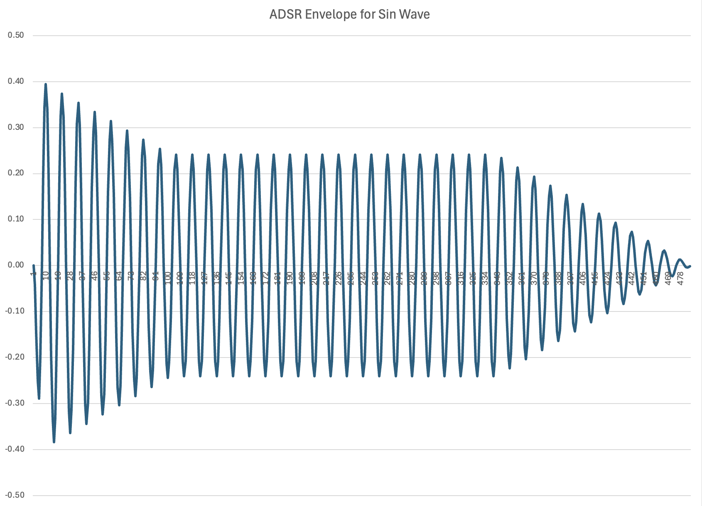

# SCPI Scripts and Tools

This repo is for various instrument control scripts for my SCPI-compatible electronics lab equipment. SCPI stands for [Standard Commands for Programmable Instruments](https://en.wikipedia.org/wiki/Standard_Commands_for_Programmable_Instruments). It's pronounced "skippy" apparently, and it goes back to 1990. Back when I was at Virginia Tech in the early 90s, I had a job with the EE department to maintain and enhance the lab software that controlled the instruments in the electronics labs. I'm pretty sure that software used SCPI back then, but I don't remember for sure. The big difference was that the physical interface for the hardware was GPIB/HPIB, which was a thick parallel cable with many pins. Modern devices now have Ethernet connections, thankfully. But, you can still get a GPIB interface add-on to Keysight devices, so I guess some labs still use it.

Current equipment list supported:

    DMM: Keysight 34470A

    Waveform Generator: Agilent (Keysight) 33511B

    Oscilloscope: RIGOL DS1104Z

    Power Supply: Keysight E36234A

## Bode Plots

bode.py produces a Bode Plot. Here's an example of a Common Emitter BJT amplifier circuit and its Bode Plot. 

And FYI, make sure you use the 10x mode on your oscope probe. Here's an [EEVblog video](https://www.youtube.com/watch?v=OiAmER1OJh4&ab_channel=EEVblog) explaining why 1x mode has reduced bandwidth.

## Waveform Generation

waveform_generator.py allows you to generate a variaty of waveforms, including drawing an arbitrary one. It's still a work in progress.

arb_waveform.py uploads a custom waveform to the Keysight waveform generator. It's currently untested.

## ADSR Sine Wave Envelope

adsr_sine.py is a cool script for generating an ADSR envelope for a sine wave at a particular frequency. This can be useful to generating an interesting synth-like sound from a function generator for an audio test. There are a lot of command line options for this script, so check out the code.

