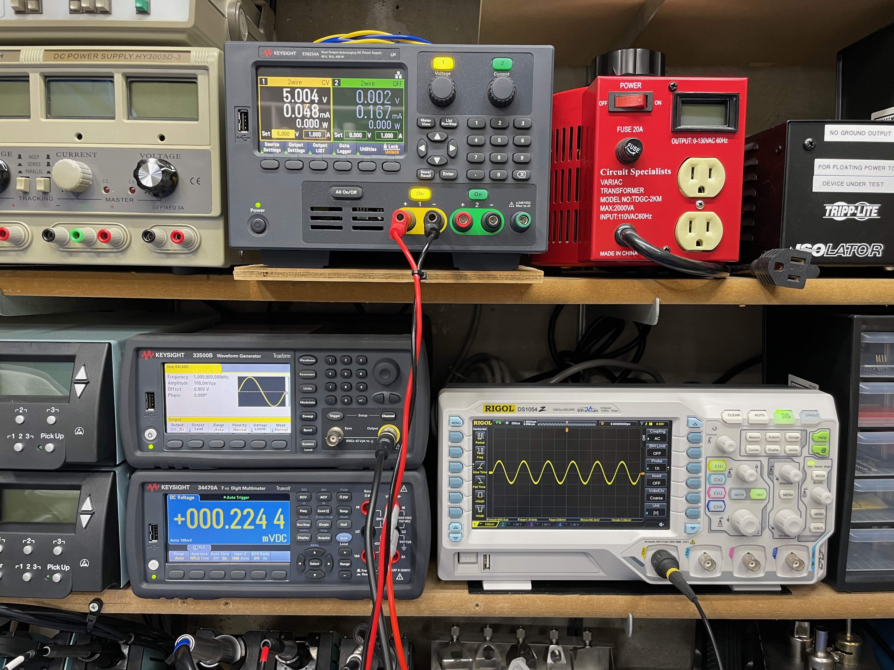

# Bode Plot and other useful SCPI scripts

This repo is for various instrument control scripts for my SCPI-compatible electronics lab equipment.

Current equipment list supported:

    DMM: Keysight 34470A

    Waveform Generator: Agilent (Keysight) 33511B

    Oscilloscope: RIGOL DS1104Z

    Power Supply: Keysight E36234A

There are some instrument detection and test functions included. But the primary function is to produce Bode Plots. Here's an example of a Common Emitter BJT amplifier circuit and it's Bode Plot.

